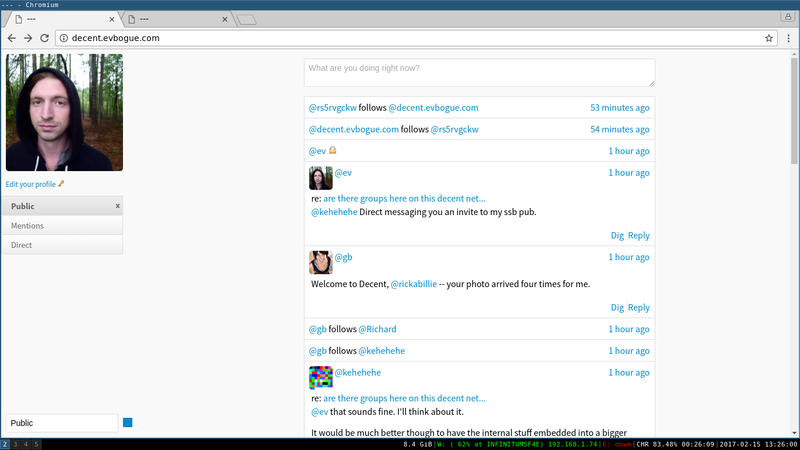

# Decent

### A decent(ralized) network for business and development

#### A learning fork and altnet that combines [Scuttlebot](http://github.com/ssbc/scuttlebot) and [Minbase](http://github.com/evbogue/minbase)

In the beginning the web was distributed. Then companies in the valley centralized it for their own profit, impoverishing the creative class of the Internet. We're creating a decent alternative.




Decent is based on [Scuttlebot](http://scuttlebot.io), but uses an alternative network key: `EVRctE2Iv8GrO/BpQCF34e2FMPsDJot9x0j846LjVtc=`.

Decent combines all of the necessary parts of Scuttlebot for a simpler install process

### Try Decent in your browser

+ http://decent.gitmx.com/
+ http://decent.evbogue.com/
+ http://decent.gwenbell.com/

### Install Decent on your local or vps

```
% git clone http://github.com/evbogue/decent.git
% cd decent && npm install
% npm run build
% npm start
```

Navigate to http://localhost:3001/ to see your Decent.

### Embed Decent on your website

```
<iframe src="http://decent.gitmx.com/" style="width: 100%; border: none; height: 24em;"></iframe>
```

If you're deploying Decent on your local or your own VPS, you will need a follow from an existing Decent pub. Please request an invite: [ev@evbogue.com](mailto:ev@evbogue.com)

Once you're on Decent, be sure to obey the first rule:

1. Be decent

Decent is maintained by [Ev Bogue](http://evbogue.com), based on the work of [Dominic Tarr](http://dominictarr.com).


